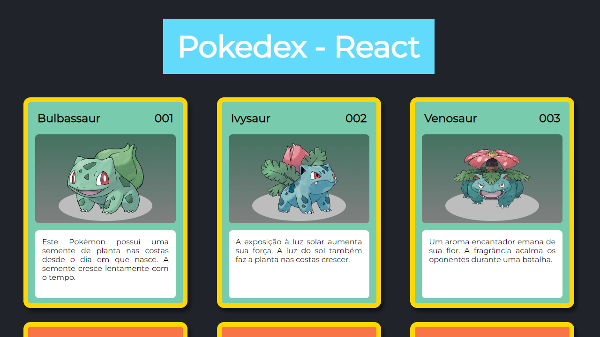

# Pokedex - React

Catálogo Pokémon utilizando React.



Projeto prático que envolve componentes, propriedades e mapeamento de arrays.

Os dados dos cards são armazenados em uma array dentro do arquivo ```pokemon.js``` . A array é exportada para ```App.js``` onde a função ```map``` irá atribuir os valores das propriedades do componente ```Card.jsx```.